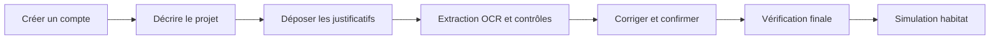

# Assistant IA — Crédit Habitat

<p align="center">
  
</p>

Application Streamlit de simulation de crédit habitat assistée par intelligence
artificielle, développée dans le cadre d'un projet de fin d'études pour le
Crédit Agricole du Maroc.

Le projet accompagne le client depuis la création de son compte jusqu'à la
simulation de financement. Il analyse les justificatifs déposés, extrait les
informations utiles, demande au client de les vérifier, puis calcule une
estimation personnalisée. Un espace conseiller permet également de suivre les
dossiers nécessitant une intervention humaine.

> **État du projet :** prototype académique fonctionnel. Il ne constitue pas
> une décision de crédit, une offre contractuelle ou un système bancaire prêt
> pour la production.

## Fonctionnalités principales

- création de compte, connexion et sauvegarde locale du dossier client ;
- parcours guidé en quatre étapes pour limiter la complexité de la simulation ;
- dépôt, consultation et suppression individuelle des justificatifs ;
- lecture hybride des PDF et images avec extraction directe ou OCR ;
- traitement des bulletins de salaire, relevés bancaires et pièces d'identité ;
- détection ciblée des informations nécessaires à la simulation ;
- calcul explicable des charges de crédits et entrées complémentaires détectées ;
- contrôle de cohérence, provenance par page et confirmation humaine ;
- estimation de la mensualité et de la capacité d'emprunt ;
- assistant virtuel **Nour** avec réponses fondées sur les documents officiels ;
- espace conseiller et journal d'audit des décisions.

## Parcours utilisateur



La simulation n'est accessible qu'après validation des informations importantes.
Le client garde toujours la possibilité de corriger une donnée détectée ou de
remplacer un justificatif.

## Architecture

Le traitement documentaire combine plusieurs mécanismes complémentaires :

1. lecture directe du texte lorsqu'un PDF le permet ;
2. OCR local pour les scans et les images ;
3. extracteurs spécialisés selon le type de document ;
4. règles déterministes pour les calculs financiers ;
5. validation de la provenance et détection des incohérences ;
6. confirmation obligatoire par l'utilisateur avant la simulation.

```text
credit-habitat-ai-assistant/
├── app.py                  # Point d'entrée Streamlit et parcours client
├── agents/                 # Orchestration OCR, extraction, RAG et validation
├── config/                 # Seuils, modèles et chemins centralisés
├── database/               # Comptes, dossiers et journal d'audit SQLite
├── extraction/             # Schémas et extracteurs documentaires
├── ocr/                    # Lecture PDF, prétraitement et PaddleOCR
├── rag/                    # Ingestion, recherche FAISS et réponses sourcées
├── rule_engine/            # Contrôles et détection des écarts
├── ui/                     # Écrans, composants et styles Streamlit
├── utils/                  # Validation et traitement des fichiers
├── workflows/              # Workflows documentaires et conversationnels
├── data/docs/              # Sources officielles utilisées par le RAG
└── tests/                  # Tests automatisés
```

## Technologies utilisées

- **Interface :** Streamlit 1.61 ;
- **OCR :** PaddleOCR 3, ONNX Runtime, OpenCV et PyMuPDF ;
- **LLM local :** Ollama avec `llama3:latest` ;
- **Orchestration :** LangGraph ;
- **RAG :** Sentence Transformers, modèle `BAAI/bge-m3` et FAISS ;
- **Validation :** Pydantic et moteur de règles métier ;
- **Persistance :** SQLite ;
- **Tests :** Pytest.

L'analyse est conçue pour fonctionner localement : les documents clients ne
sont pas envoyés volontairement vers une API d'IA externe.

## Prérequis

- Windows 10/11, Linux ou macOS ;
- Python **3.12** recommandé ;
- Git ;
- [Ollama](https://ollama.com/) pour les fonctions conversationnelles ;
- au moins 8 Go de mémoire vive, 16 Go recommandés pour l'OCR et les embeddings.

La première analyse peut être plus longue, car PaddleOCR et le modèle
d'embeddings peuvent initialiser ou télécharger leurs modèles.

## Installation

### 1. Cloner le dépôt

```bash
git clone https://github.com/YahyaElaichouni/credit-habitat-ai-assistant-v2.git
cd credit-habitat-ai-assistant-v2
```

### 2. Créer un environnement virtuel

Sous Windows PowerShell :

```powershell
py -3.12 -m venv .venv
.\.venv\Scripts\Activate.ps1
python -m pip install --upgrade pip
python -m pip install -r requirements.txt
```

Sous Linux ou macOS :

```bash
python3.12 -m venv .venv
source .venv/bin/activate
python -m pip install --upgrade pip
python -m pip install -r requirements.txt
```

Si un ancien `.venv` fait référence à une version de Python supprimée, effacez
uniquement ce dossier local puis recréez-le avec les commandes précédentes.

### 3. Préparer le modèle local

Installez et démarrez Ollama, puis téléchargez le modèle configuré :

```bash
ollama pull llama3:latest
ollama list
```

Le modèle peut être remplacé dans `config/settings.yaml`.

### 4. Configurer l'espace conseiller

Créez un fichier `.env` à la racine du projet :

```dotenv
ADVISOR_USERNAME=conseiller
ADVISOR_ACCESS_CODE=remplacer-par-un-code-securise
CREDIT_HABITAT_DB=data/client_portal.db
```

Le fichier `.env` est ignoré par Git. Ne publiez jamais de code d'accès réel
dans le dépôt.

### 5. Construire l'index documentaire

Un index est déjà fourni dans le prototype. Pour le reconstruire à partir des
documents présents dans `data/docs/` :

```bash
python -m rag.ingest
```

Seuls les documents institutionnels doivent être indexés. Les justificatifs
clients ne doivent jamais être ajoutés au corpus RAG.

## Lancer l'application

Depuis la racine du projet :

```bash
python -m streamlit run app.py
```

L'interface est ensuite disponible à l'adresse :

```text
http://localhost:8501
```

XAMPP n'est pas nécessaire. Streamlit fournit directement le serveur web et
SQLite assure le stockage local du prototype.

## Lancer les tests

```bash
python -m pytest -v
```

Pour cibler un groupe de tests :

```bash
python -m pytest tests/test_priority1.py -v
python -m pytest tests/test_review_ui.py -v
python -m pytest tests/test_guidance_agent.py -v
```

Les tests vérifient notamment les schémas d'extraction, la normalisation des
montants et dates, la provenance documentaire, les métriques des relevés et le
comportement de l'assistant.

## Configuration

Les paramètres fonctionnels sont centralisés dans `config/settings.yaml` :

| Paramètre | Valeur initiale | Rôle |
|---|---:|---|
| `confidence_threshold` | `0.85` | Seuil minimal de confiance d'un champ |
| `discrepancy_threshold` | `0.10` | Écart déclenchant une vérification |
| `max_file_size_mb` | `10` | Taille maximale d'un justificatif |
| `ocr.dpi` | `300` | Résolution de rendu des PDF scannés |
| `rag.top_k` | `5` | Nombre de passages documentaires retournés |
| `rag.similarity_threshold` | `0.35` | Seuil de refus d'une réponse hors périmètre |

Les formats acceptés sont PDF, PNG, JPG et JPEG.

## Données extraites

Pour améliorer la précision et réduire le temps d'analyse, le système se
concentre sur les informations réellement utiles à la simulation.

### Bulletin de salaire

- nom et prénom ;
- employeur ;
- poste ;
- date d'embauche ;
- période ;
- revenu mensuel net.

L'employeur, la date d'embauche et le revenu mensuel net sont prioritaires.

### Relevé bancaire

- période du relevé ;
- solde final lorsque disponible ;
- charges mensuelles de crédits ;
- entrées complémentaires détectées ;
- détail des opérations retenues ou exclues du calcul.

Les montants détectés restent à confirmer par l'utilisateur : une entrée
ponctuelle ne constitue pas nécessairement un revenu mensuel régulier.

## Sécurité et confidentialité

Le prototype applique plusieurs protections :

- dérivation des mots de passe avec PBKDF2-HMAC-SHA256 et sel aléatoire ;
- contrôle du type réel et de la taille des fichiers ;
- variables d'environnement pour l'accès conseiller ;
- journal d'audit append-only au niveau applicatif ;
- traitement OCR et LLM local ;
- exclusion des bases SQLite, fichiers `.env` et uploads du dépôt Git.

Pour une mise en production, il faudra notamment utiliser PostgreSQL, HTTPS,
un coffre à secrets, une authentification gérée, le chiffrement des documents,
des politiques de rétention, un contrôle d'accès par rôles et une supervision
centralisée.

## Dépannage

### L'application met du temps à démarrer

Le premier lancement peut prendre plusieurs dizaines de secondes à cause du
chargement des modèles OCR et d'embeddings. Les exécutions suivantes profitent
du cache local.

### `python` ne démarre pas ou pointe vers une ancienne installation

Vérifiez les versions disponibles :

```powershell
py -0p
py -3.12 --version
```

Recréez ensuite `.venv` avec l'interpréteur valide.

### Ollama est indisponible

Vérifiez que le service est démarré et que le modèle existe :

```bash
ollama list
ollama pull llama3:latest
```

L'analyse documentaire déterministe peut rester disponible, mais les réponses
conversationnelles nécessitent Ollama.

### Le code conseiller n'est pas configuré

Définissez `ADVISOR_ACCESS_CODE` dans `.env`, puis redémarrez Streamlit.

## Limites connues

- la qualité de l'extraction dépend de la lisibilité et de la structure du document ;
- certains documents atypiques nécessitent encore une correction humaine ;
- les revenus complémentaires doivent être confirmés comme récurrents ;
- SQLite est adapté à une démonstration locale, pas à une charge multi-utilisateur ;
- le résultat de simulation est indicatif et ne remplace pas l'étude d'un conseiller ;
- les modèles et règles doivent être évalués sur un corpus anonymisé plus large.

## Auteur

**Yahya El Aichouni**  
Projet de fin d'études — Digitalisation du parcours Crédit Habitat par IA.

## Licence

Aucune licence de réutilisation n'est actuellement définie. Le code et les
documents restent réservés à leur auteur et aux parties prenantes du projet
jusqu'à l'ajout éventuel d'un fichier `LICENSE`.
